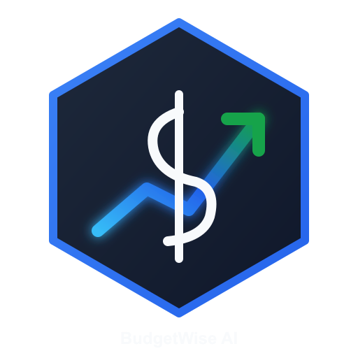

<div align="center">

  

# BudgetWise AI V2.0.2
  
  **Cross Platform Financial Assistant Monitior for International students studying abroad**

  [](https://budgetwise-ai-mobile.onrender.com/docs)
  [](https://flet.dev)
  [](https://github.com)
  [](https://python.org)
  [](LICENSE)

  [Live BudgetWiseAI Financial Model API](https://budgetwise-ai-o4xs.onrender.com)
  [BudgetWise AI API Documentation](https://budgetwise-ai-o4xs.onrender.com/docs)  

</div>

---

## 📌 Overview

**BudgetWise AI** is a multi-platform financial intelligence and predictive budget-planning system built in Python, tailored specifically for international students studying abroad helping to manage their their finances, wages, taxes and savings.

Available on desktop via (PyQt5) and native mobile deployment via (Flet / Flutter) with a fault-tolerant cloud API (Render).

---

## ✨ Core Features

* **Cross-Jurisdictional Statutory Engine:** Country meta data like COUNTRY_NAME, COUNTRY_WAGE, COUNTRY_WORK_RATE etc are fetched via the REST Countries API, paired with live foreign exchange (FX) feeds to find legal wage minimums and statutory visa work limitations automatically.
* **Algorithmic Tax & Fortnight Expenditure Analytics:** Replaces arbitrary income tax estimates with a continuous logistic withholding curve and relative logarithmic wage-differential metrics ($D$).
* **Automatic Transaction Categorizer:** Real-time Naive Bayes / Scikit-Learn pipeline trained to classify unstructured transaction payloads into standardized budget sectors instantly.
* **Product Affordability Analyzer:** Evaluates ad-hoc product purchases against historical 180-day spending velocity. Micro-purchases (<$2,000 AUD) are tested against current-week velocity and daily SafeSpend degradation, while macro acquisitions (≥$2,000 AUD) verify preservation of a 6-week emergency runway reserve.
* **Tamper-Evident `.rcd` Financial Archive Container:** Proprietary weekly binary ledger export format utilizing a 5-byte magic signature (`BWRCD`), 32-byte SHA-256 integrity checksum, and Gzip-compressed UTF-8 payloads for verifiable cross-client data portability.
* **OLS Velocity Financial Forecasting:** Dynamic linear regression engine forecasting fortnight rate of expenditure/ expenditure curve and stating the potential stability/risks of the week..
* **SafeSpend™ Dynamic Daily Limits:** Algorithmic liquidity allocator factoring semester runway timelines, fixed overheads, and weekly burn rates.
* **Multi-Platform Deployment Architecture:**
  * **Desktop:** Native standalone Windows binary (`.exe`) compiled via PyInstaller with bundled ML models.
  * **Mobile:** High-performance Android application (`.apk`) leveraging hardware-accelerated Flutter rendering.
  * **Cloud Services:** FastAPI web service deployed on Render providing microservice inference and interactive OpenAPI documentation.

---

## 🚀 Technologies & Libraries:-

* **Core Language:** Python 3.11+
* **User Interfaces:** PyQt5 (Desktop), Flet / Flutter (Mobile & PWA)
* **Backend Framework:** FastAPI, Uvicorn, Pydantic
* **Machine Learning & Analytics:** Scikit-Learn, NumPy, Pandas, Joblib and REST API
* **Data Packaging & Compression:** Gzip, Hashlib (SHA-256), Custom Binary Serialization (`.rcd`)
* **Data Visualization:** Matplotlib
* **External APIs:** Gemini API, REST Countries v3.1, Open ER Foreign Exchange
* **Packaging & CI/CD:** PyInstaller, GitHub Actions, Android SDK / Serious Python

---

## 📝 Changelogs:-

### v2.1.0 (Latest Release)
* **Added Product Affordability Analyzer:**
  * Integrated an interactive AI assistant into the desktop layout, WIP (Web API).
  * Added spending models into a Micro-velocity engine checks for items (<$2,000 AUD) and Macro Velocity Engine checks for products/items above (≥$2,000 AUD).
  * Natural language query parser with automatic regex-driven price and item extraction.
  * Added data from Cross-Jurisdictional Statutory Engine for product affordibility analyzer (MC: <=2000 AUD and MAC: >2000 AUD).
* **Added Custom `.rcd` Weekly Archive Format:**
  * Introduced native binary packing and unpacking via `models/rcd_format.py`.
  * Added user login username and passwords verification using 32-byte SHA-256 hash key for comparing .
  * Upgraded `FinancialReportPage` with weekly ledger filtering, real-time metrics generation, and direct `.rcd` file export.
* **Engine Architecture & Cloud API Enhancements:**
  * Integrated the `/api/v1/affordability/analyze` route into the FastAPI web platform.
  * Added Scikit-Learn random forest affordability risk classifier training scripts (`models/train_affordability.py`).
  * Reconciled PyQt5 UI layouts, resolving language server caching errors and workspace module conflicts.

### v2.0.0
* Updated cloud API with FastAPI, supporting live Swagger/OpenAPI documentation.
* Integrated Ordinary Least Squares (OLS) for fortnightly expenditure and stability forecasting.
* Implemented cross-jurisdiction student visa compliance checks (subclass 500 fort-nightly work caps).

---

## 🛠️ Installation & Local Setup

### Prerequisites:-

* Python 3.11 or higher
* Git
* pip 26.2.1

### Step 1: Clone Repository & Initialize Environment

```bash
git clone [https://github.com/your-username/BudgetWise-AI.git](https://github.com/your-username/BudgetWise-AI.git)
cd BudgetWise-AI

# Create and activate virtual environment
python -m venv .venv
# Windows (PowerShell)
.\.venv\Scripts\Activate.ps1
# Linux/macOS
source .venv/bin/activate